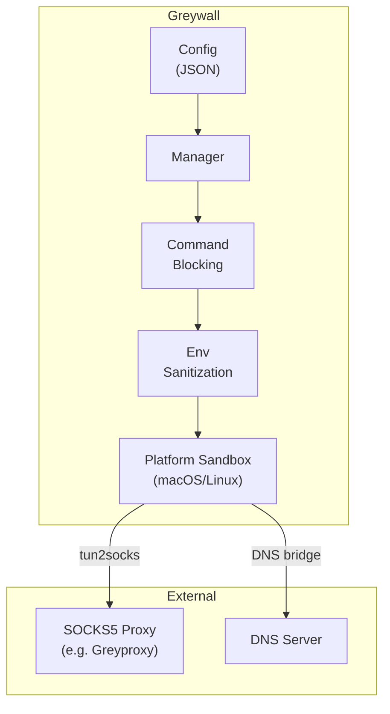
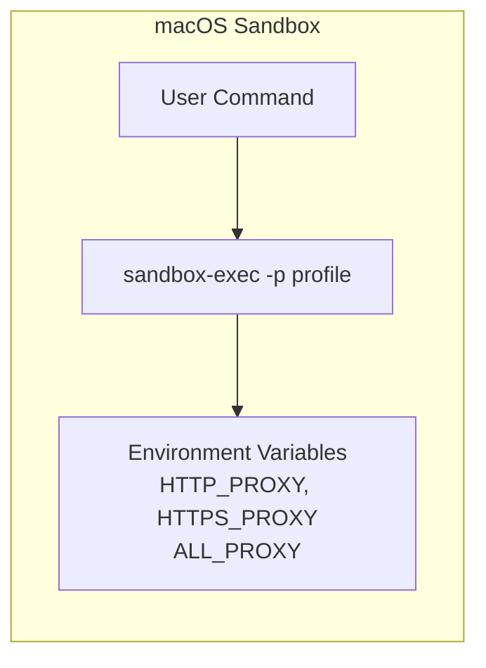
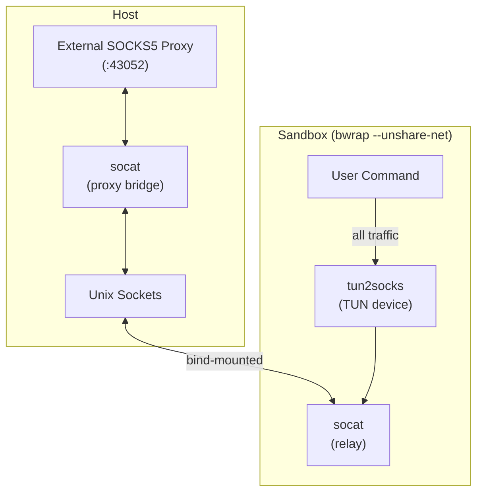
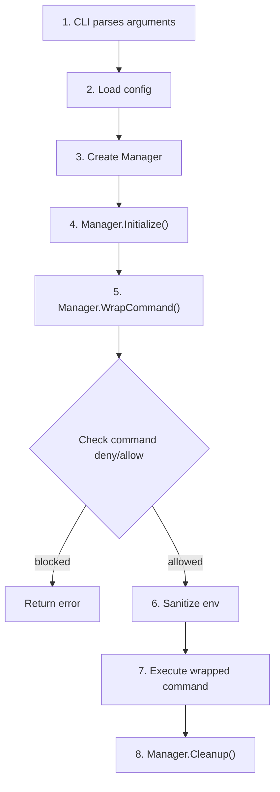

# Architecture

Greywall restricts network, filesystem, and command access for arbitrary commands. It works by:

1. **Blocking commands** via configurable deny/allow lists before execution
2. **Routing network traffic** through an external SOCKS5 proxy (e.g., [Greyproxy](../greyproxy)) via transparent TUN-based proxying
3. **Sandboxing processes** using OS-native mechanisms (macOS sandbox-exec, Linux bubblewrap)
4. **Sanitizing environment** by stripping dangerous variables (LD_PRELOAD, DYLD_INSERT_LIBRARIES, etc.)



## Project Structure

```text
greywall/
├── cmd/greywall/           # CLI entry point
│   └── main.go
├── internal/               # Private implementation
│   ├── config/             # Configuration loading/validation
│   ├── platform/           # OS detection
│   ├── proxy/              # GreyProxy detection, installation, and lifecycle
│   └── sandbox/            # Platform-specific sandboxing
│       ├── manager.go      # Orchestrates sandbox lifecycle
│       ├── macos.go        # macOS sandbox-exec profiles
│       ├── linux.go        # Linux bubblewrap + socat bridges
│       ├── linux_seccomp.go
│       ├── linux_landlock.go
│       ├── linux_ebpf.go
│       ├── command.go      # Command blocking/allow lists
│       ├── hardening.go    # Environment sanitization
│       └── utils.go
└── pkg/greywall/           # Public Go API
    └── greywall.go
```

## Core Components

### Config (`internal/config/`)

Handles loading and validating sandbox configuration:

```go
type Config struct {
    Network    NetworkConfig    // Proxy URL, DNS, localhost controls
    Filesystem FilesystemConfig // Read/write restrictions
    Command    CommandConfig    // Command deny/allow lists
    AllowPty   bool             // Allow pseudo-terminal allocation
}
```

- Loads from XDG config dir or custom path
- Falls back to restrictive defaults
- Validates paths and normalizes them

### Sandbox (`internal/sandbox/`)

#### macOS Implementation

Uses Apple's `sandbox-exec` with Seatbelt profiles. Network traffic is routed via proxy environment variables (`HTTP_PROXY`, `HTTPS_PROXY`, `ALL_PROXY`).



#### Linux Implementation

Uses `bubblewrap` (bwrap) with network namespace isolation and transparent SOCKS5 proxying:



With `--unshare-net`, the sandbox has its own isolated network namespace. Unix sockets provide cross-namespace communication. If TUN is unavailable, greywall falls back to proxy environment variables.

## Execution Flow



## Platform Comparison

| Feature | macOS | Linux |
|---------|-------|-------|
| Sandbox mechanism | sandbox-exec (Seatbelt) | bubblewrap + Landlock + seccomp |
| Network isolation | Syscall filtering | Network namespace |
| Proxy routing | Environment variables | tun2socks + socat bridges |
| Filesystem control | Profile rules | Bind mounts + Landlock (5.13+) |
| Violation monitoring | log stream | eBPF |

See [Linux Security Features](./linux-security-features) for details on the Linux security layer stack.
